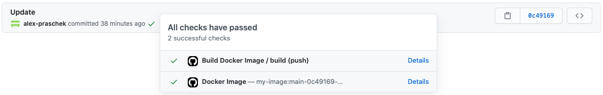

# Docker Cloud Build

Docker Cloud Build is a GitHub Action that can be used to build Docker images using Google Cloud Storage, Google Cloud
Build and Google Container Registry. It also has some more features:

- Build images for commits and tags
- Include files by specifying wildcard patterns
- Custom image tag format using branch name, hash, date, and time
- Add more tags such as latest, branch-latest or custom constants
- **Supports GitHub Commit Status**: Add the built images to your commit status
- **Supports GitHub Releases**: Add the built images to your release notes

## Usage

Just include the action in your workflow like this:

```yaml
- name: Build Docker Image
  uses: FlowSquad/docker-cloud-build@v1.0.0
  with:
    gcp-project-id: my-project-id
    gcp-service-account-key: ${{ secrets.GCP_SA_KEY }}
    image-name: my-image-name
    image-sources: build/libs/*.jar,Dockerfile,some-other-file
    github-token: ${{ secrets.GITHUB_TOKEN }}
```

## Configuration

The action can be configured by specifying several configuration options that are described in detail in the following paragraphs.

### Configuring GCP

To use Google Cloud services such as Cloud Build, Cloud Storage, or Container Registry, you first have to configure
this action. You can use the following options.

Option|Meaning
---|---
`gcp-project-id` | **Required.** The project ID to use for all GCP services.
`gcp-service-account-key` | **Required.** The content of the service account JSON file to <br> use for authentication.
`gcp-cloud-storage-bucket` | The Cloud Storage bucket to use to temporarily store the <br> Cloud Build input files. By default, a bucket with the name <br> `${projectId}_cloudbuild` will be used. The uploaded <br> files will be deleted after the build has finished. <br><br> **You have to create the specified bucket first manually.**
`gcp-gcr-region` | The region to use for Google Container Registry. Can be <br> one of the following values:<ul><li>`gcr.io`</li><li>`eu.gcr.io`</li><li>`us.gcr.io`</li><li>`asia.gcr.io`</li></ul> The default value is `eu.gcr.io`.

### Building the image

To build the image successfully, you have to specify at least these options.

Option|Meaning
---|---
`image-name` | **Required.** The name of the image to build.
`image-sources` | **Required.** The sources to use to build the image. <br><br> You can include any source files that are within your GitHub workspace, <br> such as build artifacts or Dockerfiles. The option also supports globstar <br> wildcards such as `?`, `*`, `**`, or `[...]`. Read [this](https://github.com/actions/toolkit/tree/master/packages/glob) for more details.

### Tagging the image

If the build is caused by a commit, the image will by default be tagged with branch, commit hash, and date. If it is
caused by a tag, the tag name is used instead. You can customize the tags that are applied to your image by specifying
these options.

Option|Meaning
---|---
`image-tag-latest` | Set this to `true` to add the `latest` tag to the image.
`image-tag-branch-latest` | Set this to `true` to add the `${branch}-latest` tag to <br> the image.
`image-tag-additional-tags` | Set this to a comma-separated list of values to specify <br> additional tags.
`image-tag-format` | Specify the format of the default tag if it is caused by <br> a commit. You can use the following placeholders:<pre>$BRANCH     The branch name, normalized.<br>$SHA        The 7-digit SHA of the commit<br>$YYYY       The year in 4-digit format<br>$MM         The month in 2-digit format<br>$DD         The day in 2-digit format<br>$HH         The hour in 2-digit format (24h)<br>$mm         The minute in 2-digit-format<br>$SS         The second in 2-digit-format</pre> Default: `$BRANCH-$SHA-$YYYY.$MM.$DD-$HH.$mm.$SS`.

### GitHub Integration

This action by default tries to add the built image to the GitHub UI. However, depending on the build cause (commit or
tag), there are different ways to achieve this. **You have to specify one of these options:**

Option|Meaning
---|---
`github-token` | The token to use to authenticate to GitHub. Usually the [default token <br> provided by GitHub Actions](https://docs.github.com/en/actions/reference/authentication-in-a-workflow) is sufficient. <br><br> You can specify it like this: <pre>github-token: ${{ secrets.GITHUB_TOKEN }}</pre>
`github-disabled` | Disables all GitHub integrations.

### GitHub Commit Status

If the build was caused by a commit (i.e. the `GITHUB_REF` environment variable is set to a branch name), the image will
be added to the commit's status like this, linking to the image in Google Container Registry:

*Only the second row will be added.*



You can configure this by specifying one or several of the following options:

Option|Meaning
---|---
`github-commit-status-disabled` | Set this to `true` to disable this integration.
`github-commit-status-all` | Set this to `true` to add every tag in a separate <br> row. By default, only the primary tag will be added.
`github-commit-status-description` | This option specifies the format in which the tags <br> will be displayed. The default value is `small`. <br> Can be one of the following values: <pre>large   host/project/image:tag<br><b>eu.gcr.io/flowsquad-io/my-image:latest</b><br><br>medium  project/image:tag<br><b>flowsquad-io/my-image:latest</b><br><br>small   image:tag<br><b>my-image:latest</b><br><br>tiny    tag<br><b>latest</b></pre>
`github-commit-status-title` | This option specifies the title used in the commit <br> status. The default value is `Docker Image`.

### GitHub Release information

If the build was caused by a tag (i.e. the `GITHUB_REF` environment variable is set to a tag name), the action will try
to add the image to a matching release like this:

*Only the last paragraph will be added.*


You can configure this by specifying one or several of the following options:

Option|Meaning
---|---
`github-release-information-disabled` | Set this to `true` to disable this integration.
`github-release-information-all` | Set this to `true` to add all image tags instead <br> of just the primary one.

## Example

This is an example for a GitHub Action workflow that uses this action and specifies all possible options (that are not 
exclusive to each other). You need to adapt it to your own requirements first.

```yaml
name: Build Docker Image

on:
  push: # Listen to commits
  release:
    types:
      - published # Listen to releases (you can't listen to tags directly)

jobs:
  build:
    runs-on: ubuntu-latest
    steps:
      - name: Checkout Sources
        uses: actions/checkout@v2

      - name: Setup Java 11
        uses: actions/setup-java@v1
        with:
          java-version: 11

      - name: Build Application
        run: # Build your application here, e.g.: ./gradlew build

      - name: Build Docker Image
        uses: FlowSquad/docker-cloud-build@v1.0.0
        with:
          gcp-project-id: my-project-id
          gcp-service-account-key: ${{ secrets.GCP_SA_KEY }}
          gcp-cloud-storage-bucket: my-project-id_cloudbuild      # Default value
          gcp-gcr-region: eu.gcr.io                               # Default value
          image-name: my-image
          image-sources: build/libs/*.jar,Dockerfile
          image-tag-format: $BRANCH-$SHA-$YYYY$MM$DD-$HH$mm$SS    # Optional
          image-tag-latest: true                                  # Optional
          image-tag-branch-latest: true                           # Optional
          image-tag-additional-tags: tag1,tag2,tag3               # Optional
          github-token: ${{ secrets.GITHUB_TOKEN }}
          github-commit-status-all: true                          # Optional
          github-commit-status-description: tiny                  # Optional
          github-commit-status-title: Docker                      # Optional
          github-release-information-all: true                    # Optional
```

## Contributing

We are always welcoming new contributors that are helping to improve this action.

The [Open Source Guides](https://opensource.guide/) website has a lot of information for people and companies who are 
interested in how to run and contribute to an open source project. Contributors and people new to open source will find 
[this guide on how to contribute to Open Source](https://opensource.guide/how-to-contribute/) especially helpful.

There are many ways in which you can contribute to this repository, and not all of them require you to write code:

- **Use the action!** Test the action, check if edge cases are breaking them, and open issues if anything does not work 
  as expected or could be improved. Send us your feedback.
- **Read our documentation.** Is everything covered or are there any missing parts? Is there anything left unclear?
  Open an issue if anything is missing or wrong.
- **Check our open issues.** If there is any issue you would like to work on, feel free to fork the repository and 
  submit a pull request. If you need help, let us know, we're here to help.
  
## Development Notice

To create a new release, use the task `yarn dist`. It runs ESLint, clears the cache, and creates a distributable build
including all required dependencies using @vercel/ncc.

## License

Distributed under the Apache 2.0 License.

```
Copyright 2021 FlowSquad GmbH

Licensed under the Apache License, Version 2.0 (the "License");
you may not use this file except in compliance with the License.
You may obtain a copy of the License at

http://www.apache.org/licenses/LICENSE-2.0

Unless required by applicable law or agreed to in writing, software
distributed under the License is distributed on an "AS IS" BASIS,
WITHOUT WARRANTIES OR CONDITIONS OF ANY KIND, either express or implied.
See the License for the specific language governing permissions and
limitations under the License.
```
